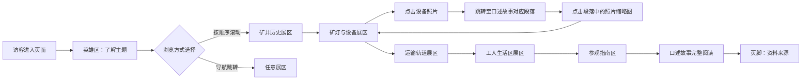

## 1. 产品概述

矿山工业遗产主题展示页面，以真实叙述的方式呈现矿井、矿灯、运输轨道和工人生活区的历史记忆。页面不美化危险劳动，通过参观指南明确安全边界与开放区域，并建立口述故事与设备照片之间的相互链接。

- 主要目的：保护并传播矿山工业记忆，以客观、尊重的态度呈现矿工群体的真实生活与工作
- 目标用户：历史爱好者、工业遗产研究者、游客、教育工作者、矿工后代
- 核心价值：通过真实史料与口述历史的结合，建立沉浸式、可交互的工业遗产数字档案

## 2. 核心功能

### 2.1 用户角色

本页面为公开浏览型内容，无需注册登录。

| 角色 | 访问方式 | 核心权限 |
|------|----------|----------|
| 普通访客 | 直接访问 | 浏览所有内容、查看口述故事、放大设备照片、查阅参观指南 |

### 2.2 功能模块

1. **页面头部导航**：品牌标识、快速锚点导航、页面主题标语
2. **英雄区**：工业遗产全景图、页面标题、核心理念说明
3. **矿井历史展区**：矿井沿革时间线、剖面图、事故记录（真实呈现）
4. **矿灯与设备展区**：设备照片卡片，点击关联口述故事段落
5. **运输轨道展区**：轨道线路图、运输历史数据、旧照片
6. **工人生活区展区**：宿舍平面图、日常生活记录、工资与劳动条件数据
7. **参观指南区**：安全边界地图、开放区域列表、禁止事项、参观须知
8. **口述故事区**：老矿工访谈录，段落锚点与对应设备照片双向跳转
9. **页脚**：资料来源鸣谢、版权声明、联系信息

### 2.3 页面详情

| 页面名称 | 模块名称 | 功能描述 |
|----------|----------|----------|
| 矿山工业遗产主页 | 头部导航 | 固定顶部、滚动时背景变化、锚点平滑滚动 |
| 矿山工业遗产主页 | 英雄区 | 大幅黑白历史照片叠加、打字机效果标语、向下滚动引导 |
| 矿山工业遗产主页 | 矿井历史 | 垂直时间线展示百年沿革、可展开的事故记录、矿井剖面交互图 |
| 矿山工业遗产主页 | 矿灯与设备 | 网格布局设备卡、悬停显示关联故事编号、点击跳转至口述区对应段落 |
| 矿山工业遗产主页 | 运输轨道 | 横向滚动线路图、运量数据图表、老照片对比滑块 |
| 矿山工业遗产主页 | 工人生活区 | 平面图热点标记、工资条扫描件、伙食与住宿条件真实描述 |
| 矿山工业遗产主页 | 参观指南 | 分区地图标注安全边界、风险等级色标、开放时段表、禁止行为清单 |
| 矿山工业遗产主页 | 口述故事 | 分段访谈文本、每段关联设备照片缩略图、点击缩略图跳转对应故事段落 |
| 矿山工业遗产主页 | 页脚 | 档案资料来源、历史照片提供者、学术顾问署名 |

## 3. 核心流程

访客进入页面后，从英雄区了解主题，通过导航或滚动依次浏览四大历史展区（矿井→矿灯→轨道→生活区），查阅参观指南了解实际访问注意事项，最后进入口述故事区，通过文本与照片的双向链接深度体验历史记忆。

## 4. 用户界面设计

### 4.1 设计风格

**整体基调：工业粗犷风（Brutalist / Industrial），不美化劳动危险，强调真实感与历史厚重感。**

- **主色调**：炭黑 `#1a1a1a`、铁灰 `#3d3d3d`、锈红 `#8b4513`、警示黄 `#c9a227`
- **辅助色**：石青灰 `#6b7280`、矿灯白 `#f5f5dc`
- **按钮风格**：方形硬角、金属质感边框、悬停时锈红高亮、无圆角无阴影
- **字体**：
  - 标题：`"Bebas Neue"` 或粗壮无衬线体，全大写，字距收紧，模拟工业铭牌刻字
  - 正文：`"Source Serif Pro"` 或衬线体，模拟老式打字机与档案印刷品
  - 数据与标签：等宽字体 `"JetBrains Mono"`，呈现档案编号与记录表感
- **布局风格**：
  - 暴露网格线与分隔符，模拟工程蓝图
  - 内容区刻意不对称，左侧时间线与右侧图文块错位排列
  - 大量使用粗边框、实线分割、编号标签（#01、#02...）
- **视觉元素**：
  - 纸张噪点纹理叠加（grain overlay）
  - 扫描线与折痕效果
  - 警示条纹边框用于危险区域提示
  - 模拟档案打孔圆、订书钉痕迹等拟物细节

### 4.2 页面设计概述

| 页面名称 | 模块名称 | UI元素 |
|----------|----------|--------|
| 矿山工业遗产主页 | 头部导航 | 固定顶部、炭黑背景、白色粗体导航、滚动后出现锈红底部分隔条 |
| 矿山工业遗产主页 | 英雄区 | 全屏黑白矿洞照片、40%透明度叠加层、超大号全大写标题、打字机动画副标题、向下箭头 |
| 矿山工业遗产主页 | 矿井历史 | 左侧垂直铁锈红时间线、右侧交错图文卡、可折叠事故记录（红边警示框）、编号标签 |
| 矿山工业遗产主页 | 矿灯与设备 | 三列等宽网格、粗黑边框卡片、悬停放大、锈红编号标记、交叉引用箭头 |
| 矿山工业遗产主页 | 运输轨道 | 横向滚动容器、蓝灰背景工程图纸风、轨道SVG线路、数据柱状图、今昔对比滑块 |
| 矿山工业遗产主页 | 工人生活区 | 平面图热点标记、弹出式资料卡、扫描件质感图片、工资数据表格（等宽字体） |
| 矿山工业遗产主页 | 参观指南 | 分区地图（风险色标：绿/黄/红）、警示条纹边框的禁止区、时段表格、注意事项清单 |
| 矿山工业遗产主页 | 口述故事 | 打字机风格衬线字体、段落首字母放大、每段右侧缩略图钉、双向高亮联动 |
| 矿山工业遗产主页 | 页脚 | 档案索引风格、细线分隔、资料来源列表、小型版权标识 |

### 4.3 响应式

- **桌面优先**，最大内容宽度 1440px，两侧保留工程页边距
- **平板（768px-1024px）**：三列网格改为两列，时间线居中对齐
- **移动端（<768px）**：单列布局，导航转为汉堡菜单，横向轨道图改为纵向时间轴，地图分区简化为列表
- **触摸优化**：设备卡点击热区扩大至 48px，口述故事段落可整段点击跳转

### 4.4 动效与交互

- **入场动画**：页面加载时各区块从左侧/右侧交错滑入（staggered reveal），模拟档案逐页翻开
- **悬停效果**：设备卡悬停时边框变锈红、轻微抬升（2px）、关联编号闪烁
- **双向链接**：点击设备卡 → 口述区对应段落淡入高亮并滚动至视口；点击口述段落照片 → 返回设备区并放大对应卡片
- **滚动进度**：顶部细条锈红进度指示
- **打字机动画**：英雄区标语与口述故事首段逐字显示
