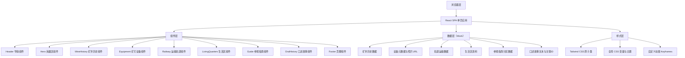

## 1. 架构设计

本项目为单页静态展示型网站，采用纯前端架构，无需后端服务。所有历史数据、口述内容、设备信息均以内嵌 Mock 数据方式存储于前端代码中。



## 2. 技术描述

- **前端框架**：React@18 + TypeScript@5
- **构建工具**：Vite@5
- **样式方案**：Tailwind CSS@3（自定义工业主题配色与字体）
- **状态管理**：React Hooks（useState、useEffect、useRef）+ Context API（用于设备-口述双向联动高亮状态）
- **图标**：React Icons（Lucide 工业风图标集）
- **数据**：内嵌 TypeScript 常量对象作为 Mock 数据，图片使用 text_to_image API 生成
- **无需后端**：纯静态部署，所有数据前端内置

## 3. 路由定义

单页应用，所有模块通过锚点（hash/section id）导航。

| 路由 / 锚点 | 对应模块 | 说明 |
|-------------|----------|------|
| `/#top` | 英雄区 | 页面顶部 |
| `/#mine-history` | 矿井历史 | 百年沿革时间线 |
| `/#equipment` | 矿灯与设备 | 设备卡片网格 |
| `/#railway` | 运输轨道 | 轨道与运量数据 |
| `/#living-quarters` | 工人生活区 | 宿舍与生活资料 |
| `/#guide` | 参观指南 | 安全边界与开放区域 |
| `/#oral-history` | 口述故事 | 访谈文本与双向链接 |
| `/#footer` | 页脚 | 资料来源 |

## 4. API 定义（无后端）

本项目不涉及后端 API 调用，所有数据通过 TypeScript 模块导出。核心数据接口类型如下：

```typescript
// 矿井历史事件
interface MineHistoryEvent {
  id: string;
  year: string;
  title: string;
  description: string;
  isAccident: boolean; // 是否为事故记录（警示红框）
  severity?: 'minor' | 'major' | 'catastrophic';
}

// 矿灯/设备
interface Equipment {
  id: string;
  name: string;
  serialNumber: string; // 设备编号
  era: string; // 使用年代
  image: string; // 照片URL
  description: string;
  linkedStoryId: string; // 关联口述故事段ID
}

// 运输轨道数据
interface RailwayRecord {
  year: string;
  lengthKm: number; // 轨道里程（公里）
  annualTonnage: number; // 年运量（万吨）
}

// 生活区资料
interface LivingQuarterData {
  id: string;
  category: 'dormitory' | 'canteen' | 'bathhouse' | 'clinic';
  name: string;
  image: string;
  description: string;
  statistics?: Record<string, string | number>; // 如容纳人数、伙食费等
}

// 参观指南分区
interface GuideZone {
  id: string;
  name: string;
  riskLevel: 'safe' | 'caution' | 'danger' | 'restricted';
  isOpen: boolean;
  openingHours?: string;
  notes: string[];
}

// 口述故事段落
interface OralStoryParagraph {
  id: string;
  speakerName: string;
  speakerRole: string; // 如：井下采煤工、电机车司机等
  era: string;
  text: string;
  linkedEquipmentIds: string[]; // 关联设备ID数组
  thumbnail: string; // 对应设备缩略图
}
```

## 5. 数据模型（内嵌 Mock）

### 5.1 模块结构

```
src/
├── data/
│   ├── mineHistory.ts      # 矿井历史事件列表
│   ├── equipment.ts        # 矿灯与设备数据
│   ├── railway.ts          # 轨道运输数据
│   ├── livingQuarters.ts   # 生活区资料
│   ├── guideZones.ts       # 参观指南分区
│   └── oralStories.ts      # 口述故事段落
├── types/
│   └── index.ts            # 全局类型定义
├── context/
│   └── LinkageContext.tsx  # 设备-口述联动状态Context
└── components/
    ├── Header.tsx
    ├── Hero.tsx
    ├── MineHistory.tsx
    ├── EquipmentGrid.tsx
    ├── RailwaySection.tsx
    ├── LivingQuarters.tsx
    ├── VisitGuide.tsx
    ├── OralHistory.tsx
    └── Footer.tsx
```

### 5.2 联动机制说明

**设备卡 → 口述故事**：
- 点击 `Equipment` 卡 → dispatch `setHighlightedStoryId(linkedStoryId)` → `OralHistory` 组件监听 Context 变化 → 滚动至对应 `#story-{id}` 并添加高亮闪烁动画

**口述故事 → 设备卡**：
- 点击 `OralStoryParagraph` 右侧缩略图 → dispatch `setHighlightedEquipmentId(id)` → `EquipmentGrid` 组件监听 → 滚动至 `#equipment-{id}` 并放大对应卡片

高亮状态持续 3 秒后自动清除。
